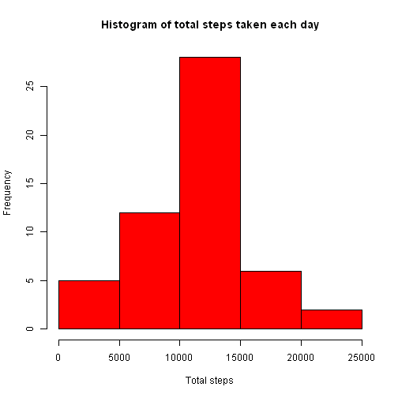
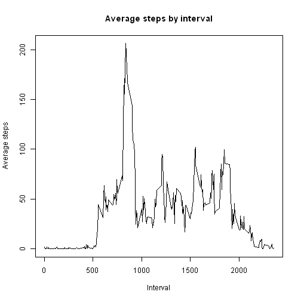
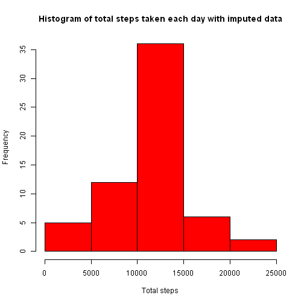

# Reproducible Research: Peer Assessment 1
### Arpit Shah

## Setting environment and loading libraries
First, let's set up the global options for this report.

```r
# numbers >= 10^5 will be denoted in scientific notation, and rounded to 2 digits
options(scipen = 1, digits = 2)
```

Next, we will check to see if the necessary packages have been installed. If not, the code chunk will install and load them as well.

```r
if (!"dplyr" %in% installed.packages()) install.packages("dplyr")
if (!"ggplot2" %in% installed.packages()) install.packages("ggplot2")
if (!"lattice" %in% installed.packages()) install.packages("lattice")
if (!"lubridate" %in% installed.packages()) install.packages("lubridate")
library(dplyr)
library(ggplot2)
library(lattice)
library(lubridate)
```

## Loading and preprocessing the data
### Check for data file
First, we'll check to see if the data file has already been stored in the current directory. If not, then we will need to go ahead and download the file.

```r
if(!file.exists("activity.zip")) {
  download.file("https://d396qusza40orc.cloudfront.net/repdata%2Fdata%2Factivity.zip", destfile="activity.zip", method="curl")
  message("The data file has been successfully downloaded.")
} else {
  message("Data file exists, and did not need to be downloaded.")
  }
```

```
## Data file exists, and did not need to be downloaded.
```

### Unzip the data file
Now that the data file has been obtained, we can go ahead and unzip it.

```r
unzip("activity.zip")
```

### Load the data file
Once the data file has been unzipped, we will proceed to load it. We will use the `read.csv()` function to do so.

```r
data <- read.csv("activity.csv", colClasses = c("integer","character","integer"), stringsAsFactors = FALSE)
```

### Transform the data
We need to transform the data to ensure that the variables are of the right type. The `steps` and `interval` variables were both loaded as an `integer` data type, while the `date` variable was loaded as a `character` type.  
The `date` variable needs to be recast as a date, using the `strptime()` function.  
The `interval` variable needs to be recast in hours and minutes, using the `hm()` function.  
A new variable, `timestamp` is created to contain the YMD HMS formatted date.

```r
data$date <- strptime(data$date,"%F")
data$intervalhm <- hm(format(data$interval/100, nsmall="2"))
data$timestamp <- ymd_hms(paste(data$date, paste(hour(data$intervalhm),":", minute(data$intervalhm),":",second(data$intervalhm), sep="")))
data$intervalchar <- paste(hour(data$intervalhm),":",minute(data$intervalhm),sep="")
```

## What is mean total number of steps taken per day?
First, we need to calculate the total number of steps by grouping the data (using `group_by()`) and summarizing the data (using `summarize()`).

```r
data_grpbydate <- data %>% select(date, steps) %>% group_by(date = as.POSIXct(date))
data_totsteps <- summarize(data_grpbydate, totsteps = sum(steps))
```

Next, we plot the histogram of total steps taken each day.

```r
hist(data_totsteps$totsteps[!is.na(data_totsteps$totsteps)], col="red", xlab="Total steps", main="Histogram of total steps taken each day")
```

 

Finally, we calculate the mean and median of total steps taken each day, and report them out in the block after the code chunk.

```r
totsteps_mean <- round(mean(data_totsteps$totsteps, na.rm=TRUE), digits = 0)
totsteps_median <- median(data_totsteps$totsteps, na.rm=TRUE)
```

> The mean total number of steps taken per day is **10766**.  
> The median total number of steps taken per day is **10765**.

## What is the average daily activity pattern?
First, we need to calculate the average number of steps across days by grouping the data (using `group_by()`) and summarizing the data (using `summarize()`).

```r
data_grpbyinterval <- data %>% select(interval, steps) %>% group_by(interval)
data_avgsteps <- summarize(data_grpbyinterval, avgsteps = mean(steps, na.rm=TRUE))
```

Next, we plot the time series.

```r
plot(data_avgsteps$interval, data_avgsteps$avgsteps,
     type="l", xlab="Interval", ylab="Average steps", main="Average steps by interval")
```

 

Finally, we determine the 5-minute interval that, on average across all days, contains the maximum number of steps.

```r
maxint_avgsteps <- data_avgsteps$interval[which.max(data_avgsteps$avgsteps)]
```

> The interval with the maximum number of average steps is: **835**

## Imputing missing values

### Calculate the total number of missing values
By inspecting the data, we see that only the `steps` variable may have missing values. Therefore, we calculate the number of rows where `steps` is `NA`.

```r
num_nasteps <- sum(is.na(data$steps))
```
> The number of rows with `NA`s is: **2304**

### Fill in the missing values
To fill in the missing step values in the dataset, we will use the mean steps for that 5 minute interval.

```r
merged_data <- merge(data, data_avgsteps, by.x = "interval", by.y = "interval", all.x = TRUE)
merged_data$steps[which(is.na(merged_data$steps))] <- merged_data$avgsteps[which(is.na(merged_data$steps))]
```

### Create a new data set with missing data filled in
The data frame `imputed_data` contains the new data set.

```r
imputed_data <- merged_data %>% select(interval,steps,date,intervalhm)
```

### Generate the histogram
Calculate the total number of steps by grouping the imputed data (using `group_by()`) and summarizing the data (using `summarize()`).

```r
data_grpbydate_imputed <- imputed_data %>% select(date, steps) %>% group_by(date = as.POSIXct(date))
data_totsteps_imputed <- summarize(data_grpbydate_imputed, totsteps = sum(steps))
```

Next, we plot the histogram of total steps taken each day using the imputed data.

```r
hist(data_totsteps_imputed$totsteps, col="red", xlab="Total steps", main="Histogram of total steps taken each day with imputed data")
```

 

Finally, we calculate the mean and median of total steps taken each day, and report them out in the block after the code chunk.

```r
totsteps_mean_imputed <- round(mean(data_totsteps_imputed$totsteps, na.rm=TRUE), digits = 0)
totsteps_median_imputed <- median(data_totsteps_imputed$totsteps, na.rm=TRUE)
```

> The mean total number of steps taken per day is **10766**.  
> The median total number of steps taken per day is **10766.19**.

**These values do not differ significantly from the estimates in the first part of the assignment, so there does not seem to be a significant impact of imputing missing data.**

## Are there differences in activity patterns between weekdays and weekends?


```r
imputed_data$daytype <- factor(weekdays(imputed_data$date, abbreviated=TRUE))
```

```
## Error in weekdays(imputed_data$date, abbreviated = TRUE): unused argument (abbreviated = TRUE)
```
